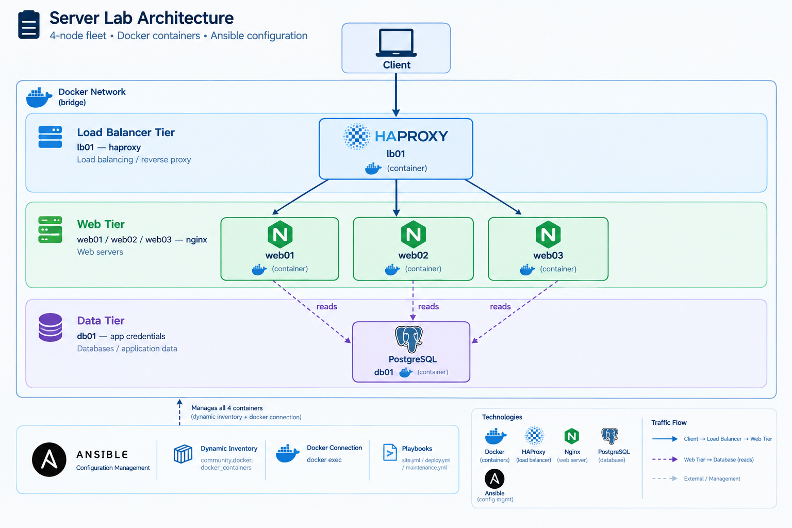

# Server Lab — A Hands-On Ansible Configuration Management Project

A 4-node fleet (load balancer + web tier + database), fully provisioned and configured by **Ansible**, running entirely on **Docker containers** standing in for real servers. No cloud account, no cost, fully reproducible from a clean clone.

This isn't a tutorial repo — it's a working lab built specifically to hit the real problems Ansible engineers actually run into (drift, non-systemd containers, variable precedence conflicts, failed deploys, leaked secrets, lying check-mode reports) and solve them the way a senior engineer would, with the reasoning documented alongside the code.

---

## Architecture



All four nodes are Docker containers on a shared bridge network, targeted by Ansible through a **dynamic inventory** (`community.docker.docker_containers`) that groups them by Docker label — the same pattern you'd use to group real EC2 instances by tag. Ansible reaches every container through the **Docker connection plugin** (`docker exec`) rather than SSH; every playbook here would run completely unchanged against real SSH-reachable servers — only the inventory source and connection type would need to change.

---

## Why Docker instead of a cloud sandbox

This project deliberately does **not** use LocalStack or a real cloud account. LocalStack's EC2 emulation doesn't boot a real, reachable operating system, so it's the wrong tool for practicing actual configuration management — there's no real OS to install packages on, manage services on, or drift. Docker containers give genuine Linux, real package managers, and real idempotency to prove, for zero cost and a 20-second full reset (`docker compose down -v && up -d`).

(LocalStack is the right tool for the **Terraform** project that follows this one — provisioning infrastructure is a different problem than configuring what runs on it.)

---

## What's actually in here

| Role | Does |
|---|---|
| `common` | Baseline config applied fleet-wide: packages, a managed user, cron running without relying on systemd (these containers don't run an init system — see [Problems Solved](#problems-solved-along-the-way)) |
| `nginx` | Web server, config templated per-host, graceful reload via `nginx -s reload` |
| `haproxy` | Load balancer with a live backend list generated from inventory — add a web node and the config regenerates itself, no manual editing |
| `app_deploy` | Rolling, health-checked deploy with automatic rollback (`block`/`rescue`/`always`) and real load-balancer drain/re-add via HAProxy's runtime admin socket |
| `db_stub` | Deploys app credentials sourced from an Ansible Vault–encrypted secret |

| Playbook | Purpose |
|---|---|
| `playbooks/site.yml` | Full fleet configuration: baseline → web → lb → db |
| `playbooks/deploy.yml` | Rolling application deploy, one host at a time, LB-aware |
| `playbooks/maintenance.yml` | Fleet diagnostics, plus a destructive cleanup task locked behind the `never` tag |

---

## Quick start

Requires Docker + Docker Compose and Python 3.9+.

```bash
git clone <this-repo>
cd ansible-server-lab

python3 -m venv .venv && source .venv/bin/activate
pip install ansible-core ansible-lint
ansible-galaxy collection install -r requirements.yml

docker compose up -d --build

ansible-inventory -i inventory/docker.yml --graph      # confirm the fleet is grouped correctly
ansible all -i inventory/docker.yml -m ping             # confirm Ansible can reach every node

ansible-playbook -i inventory/docker.yml playbooks/site.yml
ansible-playbook -i inventory/docker.yml playbooks/site.yml    # run twice — second run should show changed=0 everywhere
```

Deploy a release:

```bash
ansible-playbook -i inventory/docker.yml playbooks/deploy.yml -e app_version=1.0.0
```

Vault-encrypted secrets require the project's vault password file (not committed — see `.gitignore`):

```bash
ansible-playbook -i inventory/docker.yml playbooks/site.yml --vault-password-file .vault_pass.txt
```

---

## Problems solved along the way

This is the part that actually matters more than the playbooks themselves — every one of these was a genuine failure hit and fixed during the build, not a hypothetical:

- **No init system in the containers.** `ansible.builtin.service` failed outright with `System has not been booted with systemd as init system (PID 1)`. Fixed by managing cron manually and idempotently with `command` + `register` + `changed_when`, with the trade-off (no auto-restart on crash) documented rather than hidden.
- **Variable precedence conflicts, proven, not assumed.** `nginx_port` is set at four different layers (role default, `group_vars/all`, `group_vars/role_web`, and `-e` on the CLI) specifically to watch the real winner resolve, rather than trusting a mental model of the precedence chain.
- **A deliberately broken deploy.** The rolling-deploy role was tested against a release that "deploys" successfully but fails its content health check — triggering an automatic rollback via `block`/`rescue`/`always`, and halting the rollout before it reached the remaining web nodes.
- **A simulated secret leak.** The project's Vault password was deliberately committed on a throwaway branch to work through what real remediation requires (rotate the secret; understand that deleting a file doesn't erase git history) — documented in `notes/phase7-vault-incident.md`.
- **Check mode silently lying.** `--check` mode doesn't error on `command`/`shell` tasks — it fabricates a fake `rc: 0` success result. A `when:` condition built on that result will always evaluate as "nothing to do" during a dry run, whether or not that's true. Fixed with `check_mode: false` on every affected check, once the pattern was found.
- **A CI pipeline that can't lie to itself.** The GitHub Actions pipeline doesn't just run the playbook once — a second job re-applies on every merge to `main` and fails the whole pipeline if anything reports `changed`, so idempotency is proven automatically, not just proven once by hand and trusted forever after.
- **Drift that nothing was watching for.** Manually editing a config file inside a running container proved a real, uncomfortable point: Ansible only fixes what you tell it to run against — nothing detects drift on its own between runs. A separate `--check`-only playbook, run on a schedule in a real deployment (not ephemeral CI), is what closes that gap — documented in `notes/phase11-drift-detection.md`.

---

## Engineering journal

Every deliberately-injected problem in this project has a short, real write-up — these are the actual artifacts worth reading before the code itself:

- [`notes/phase2-facts.md`](notes/phase2-facts.md) — finding undocumented fleet drift using only ad-hoc commands
- [`notes/phase6-rollback.log`](notes/phase6-rollback.log) — a real failed deploy, caught and rolled back automatically
- [`notes/phase7-vault-incident.md`](notes/phase7-vault-incident.md) — simulating a leaked secret and the real remediation it requires
- [`notes/phase11-drift-detection.md`](notes/phase11-drift-detection.md) — the agent/agentless, push/pull exercise, in my own words

## Project status

Built in phases, each with its own real-world problem baked in on purpose:

- [x] Phase 0 — Environment & repo setup
- [x] Phase 1 — Fleet & dynamic inventory
- [x] Phase 2 — Ad-hoc fleet inspection & drift-finding
- [x] Phase 3 — Baseline role & proven idempotency
- [x] Phase 4 — Templates & variable precedence
- [x] Phase 5 — Load balancer & inventory-driven config
- [x] Phase 6 — Rolling deploy with automatic rollback
- [x] Phase 7 — Secrets with Ansible Vault
- [x] Phase 8 — Tags & safe destructive operations
- [x] Phase 9 — Molecule testing & the check-mode gotcha
- [x] Phase 10 — CI pipeline (GitHub Actions)
- [x] Phase 11 — Drift detection & the push/pull conversation

---

## Requirements

- Docker + Docker Compose
- Python 3.9+
- `ansible-core`, `ansible-lint`
- Collections: `community.docker`, `community.general` (pinned in `requirements.yml`)

## License

MIT
